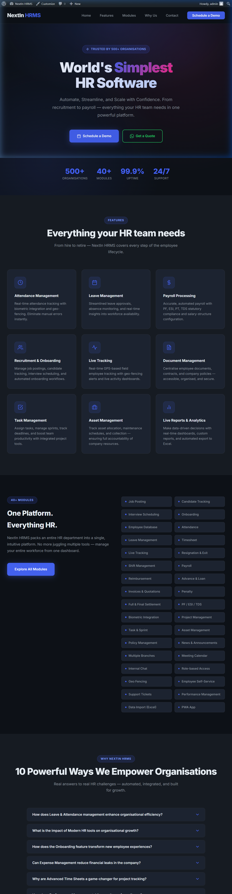
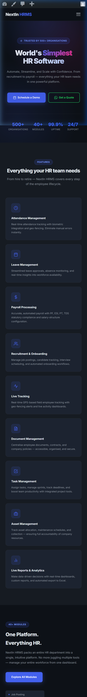

# NextIn HRMS – WordPress Landing Page Theme

A clean, responsive, manually-coded WordPress theme for the **NextIn HRMS** landing page.

🌐 **Reference:** [nextincube.com/hrms](https://nextincube.com/hrms)

---

## 📁 Theme Files

```
nextin-hrms/
├── style.css        # WordPress theme header + full CSS
├── functions.php    # wp_enqueue_style(), theme setup, nav menus
├── header.php       # Sticky nav, logo, hamburger menu, wp_head()
├── footer.php       # Contact info, WhatsApp link, JS, wp_footer()
└── index.php        # All page sections (Hero, Features, Modules, FAQ, CTA)
```

---

## 🚀 Sections Built

| Section | Description |
|---|---|
| **Header / Nav** | Sticky, blur-backdrop nav with logo, links, and mobile hamburger |
| **Hero** | "World's Simplest HR Software" headline + subheading + dual CTAs |
| **Features** | 3-column CSS Grid with 9 feature cards + SVG icons + hover effects |
| **All Modules** | 34 module tags in a 2-column grid |
| **Why NextIn HRMS** | FAQ accordion with 10 questions |
| **CTA Banner** | Full-width call-to-action with Demo + WhatsApp buttons |
| **Footer** | Phone, email, WhatsApp contact + copyright |

---

## ✅ Technical Requirements

- ✅ Custom WordPress theme (no page builders)
- ✅ `wp_enqueue_style()` to load Google Fonts (Inter) + stylesheet
- ✅ Fully responsive — CSS Flexbox + Grid, mobile hamburger menu
- ✅ All decorative icons use `aria-hidden="true"`, proper `alt` on images
- ✅ Semantic HTML5: `<header>`, `<main>`, `<footer>`, `<article>`, `<section>`

## 🎁 Bonus Features

- ✅ **"Get a Quote"** button → WhatsApp with pre-filled message
- ✅ **Hover effects** on feature cards (lift + gradient border + shadow)
- ✅ **Google Fonts (Inter)** via `wp_enqueue_style()`

---

## 🛠️ How to Install Locally

1. Copy the `nextin-hrms` folder to:
   ```
   your-wordpress-install/wp-content/themes/nextin-hrms/
   ```
2. Open **WordPress Admin → Appearance → Themes**
3. Activate **NextIn HRMS**
4. Visit your site's homepage to see the landing page

---

## 📝 Submission Note

I built a custom WordPress theme called **nextin-hrms** for the NextIn HRMS landing page installed locally on XAMPP. All 5 required theme files (`style.css`, `functions.php`, `header.php`, `footer.php`, `index.php`) were hand-coded in HTML, CSS, and PHP — no page builders used. Google Fonts (Inter) is loaded correctly via `wp_enqueue_style()`. The layout uses CSS Grid for the 3-column features section and CSS Flexbox throughout for responsive design.

Bonus features include a WhatsApp "Get a Quote" button, hover lift animations on feature cards with a gradient top border, a JavaScript FAQ accordion, and a fully functional mobile hamburger menu. The main challenge was building a polished dark-mode design from scratch that closely followed the reference site's structure while remaining fully responsive across all screen sizes.

---

## 📸 Screenshots

### Desktop


### Mobile


---

## 👤 Author

Built for **NextIn Cube Solution LLP** — [nextincube.com](https://nextincube.com)
